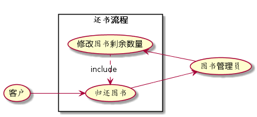

# 实验2：图书管理系统用例建模

学号：201510414217

班级：15级软工2班

姓名：万佳羽

## 1. 图书管理系统的用例关系图

### 1.1 用例图PlantUML源码如下：

```
@startuml
left to right direction
skinparam packageStyle rectangle
actor (客户)
actor (图书管理员)
actor (系统维护员)

rectangle (图书馆系统){
(客户)-->(登录)
(查询图书).>(登录):include
(客户)-->(借书卡挂失)
(客户)-->(查询借阅情况)
(客户)-->(预订图书)
(客户)-->(取消预订)
(客户)-->(归还图书)

(取消预订).>(预订图书):include
(借出图书)<--(图书管理员)
(预订图书)<.(借出图书):include
(修改客户借阅信息)<--(图书管理员)
(图书管理员)-->(修改书目)
(修改书目).>(添加书目):extend
(删除书目)<.(修改书目):extend

(系统维护员)-->(借书卡管理)
(借书卡管理).>(借书卡挂失):extend
(借书卡补办)<.(借书卡管理):extend
(系统维护员)-->(系统定期检查)
(系统维护员)-->(系统升级)
}
@enduml
```

### 1.2 用例图如下：


## 2. 参与者说明：

### 2.1 图书管理员

主要职责：

1. 帮助已预订的客户找寻书籍并借出给客户
2. 修改客户借阅书籍信息以及修改书目

### 2.2 读者

主要职责：

1. 可以通过查询书籍来借阅图书以及归还图书
2. 可以挂失借书卡并请求补卡
3. 可查看自己的借阅书籍情况

### 2.3 系统维护员

主要职责：

1. 可以为挂失借书卡的客户进行借书卡补办
2. 定期检查图书管理系统并负责在必要时升级系统

## 3.用例规约表

### 3.1 “借出图书”用例

|  Title   |                             内容                             |
| :------: | :----------------------------------------------------------: |
| 用例名称 |                           借出图书                           |
|  参与者  |         图书管理员（主要参与者），读者（次要参与者）         |
| 前置条件 |                   图书管理员已被识别和授权                   |
| 后置条件 |        存储借书记录，更新库存数量，所借图书状态为借出        |
| 主事件流 | 1.图书管理员将读者借书卡提供给系统<br>2.系统验证读者身份和借书条件<br>3.图书管理员将读者所借图书输入系统<br>4.系统记录借书信息，并且修改图书的状态和此种书的可借数量<br>5.系统累加读者的借书数量<br>6.重复3~5，直到图书管理员确认全部图书登记完毕<br>7.系统打印借书清单，交易成功完成 |
|   备注   | 图书馆开架借阅，读者找到书后办理借书手续，因此借书不需要验证库存，<br>而且每本书都是可识别的 |

### 3.2 “归还图书”用例

|  Title   |                             内容                             |
| :------: | :----------------------------------------------------------: |
| 用例名称 |                           归还图书                           |
|  参与者  |         图书管理员（主要参与者），读者（次要参与者）         |
| 前置条件 |                   图书管理员已被识别和授权                   |
| 后置条件 |     修改借书记录，更新库存数量，所借图书状态为归还且可借     |
| 主事件流 | 1.图书管理员将读者借书卡提供给系统<br>2.系统验证读者身份和归还条件<br>3.图书管理员将读者所还图书输入系统<br>4.系统记录还书信息，并且修改图书的状态和此种书的可借数量<br>5.系统累加读者的可借书数量<br>6.重复3~5，直到图书管理员确认全部图书登记完毕<br>7.系统打印还书清单，交易成功结束 |
|   备注   | 还书时图书管理员需检查图书的完好性，若有破损，则需一定的金额赔偿 |

**“借出图书”用例流程图源码如下：**

```
@startuml
left to right direction
skinparam packageStyle rectangle
actor (客户)
actor (图书管理员)

rectangle (借书流程){
(图书管理员)-->(借出图书)
(借出图书)-->(客户)
(借出图书)<.(修改图书剩余数量):include
(图书管理员)-->(修改图书剩余数量)
}
@enduml
```

**“借出图书”用例流程图如下：**


**“归还图书”用例流程图源码如下：**

```
@startuml
left to right direction
skinparam packageStyle rectangle
actor (客户)
actor (图书管理员)

rectangle (还书流程){
(客户)-->(归还图书)
(归还图书)-->(图书管理员)
(归还图书)<.(修改图书剩余数量):include
(图书管理员)-->(修改图书剩余数量)
}
@enduml
```

**“归还图书”用例流程图如下：**



