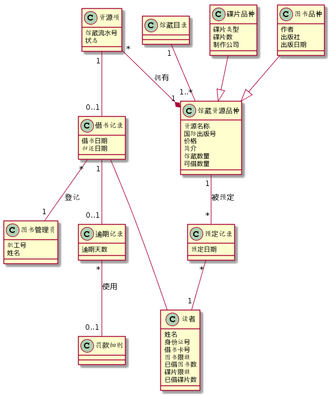
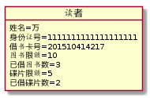
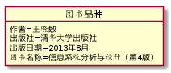
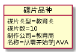
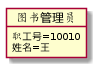
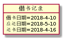

# 实验3：图书管理系统领域对象建模

学号：201510414217

班级：15级软工2班

姓名：万佳羽

## 1. 图书管理系统的类图

### 1.1 类图PlantUML源码如下：

```
@startuml
class 馆藏目录
class 馆藏资源品种{
 资源名称
 国际出版号
 价格
 简介
 馆藏数量
 可借数量
}
馆藏目录 "1"--"1..*" 馆藏资源品种
class 碟片品种{
 碟片类型
 碟片数
 制作公司
}
class 图书品种{
 作者
 出版社
 出版日期
}
碟片品种 --|> 馆藏资源品种
图书品种 --|> 馆藏资源品种
class 资源项{
 馆藏流水号
 状态
}
资源项 "*"--*"1" 馆藏资源品种:拥有
class 借书记录{
 借书日期
 归还日期
}
资源项 "1"--"0..1" 借书记录
class 预定记录{
 预定日期
}
馆藏资源品种 "1"--"*" 预定记录:被预定
class 读者{
 姓名
 身份证号
 借书卡号
 图书限额
 已借图书数
 碟片限额
 已借碟片数
}
预定记录 "*"--"1" 读者
借书记录 -- 读者
class 图书管理员{
 职工号
 姓名
}
借书记录 "*"--"1" 图书管理员:登记
class 逾期记录{
 逾期天数
}
借书记录 "1"--"0..1" 逾期记录
class 罚款细则
逾期记录 "*"--"0..1" 罚款细则:使用
@enduml
```

### 1.2. 类图如下：



### 1.3. 类图说明：

以【馆藏资源品种】为中心，连接上【馆藏目录】，【碟片品种】，【图书品种】，【资源项】以及【预定记录】，并注意各关系之间的对应数量。之后再【读者】对应上【预定记录】和【借书记录】，【借书记录】又再对应上【图书管理员】和【逾期记录】，最后【逾期记录】与【罚款细则】对应上上，关系为使用与被使用。

## 2. 图书管理系统的对象图

### 2.1 类【读者】的对象图

#### 源码如下：

```
@startuml
object 读者{
 姓名=万
 身份证号=1111111111111111111
 借书卡号=201510414217
 图书限额=10
 已借图书数=3
 碟片限额=5
 已借碟片数=2
}
@enduml
```

#### 对象图如下：



### 2.2 类【图书品种】的对象图

#### 源码如下：

```
@startuml
object 图书品种{
 作者=王晓敏
 出版社=清华大学出版社
 出版日期=2013年8月
 图书名称=信息系统分析与设计（第4版）
}
@enduml
```

#### 对象图如下：



### 2.3 【碟片品种】的对象图

#### 源码如下：

```
@startuml
object 碟片品种{
 碟片类型=教育类
 碟片数=10
 制作公司=教育局
 名称=从零开始学JAVA
}
@enduml
```

#### 对象图如下：



### 2.4 类【图书管理员】的对象图

#### 源码如下：

```
@startuml
object 图书管理员{
 职工号=10010
 姓名=王
}
@enduml
```


#### 对象图如下：



### 2.5 类【借书记录】的对象图

#### 源码如下：

```
@startuml
object 借书记录{
 借书日期=2018-4-10
 应还日期=2018-5-10
 还书日期=2018-4-16
}
@enduml
```


#### 对象图如下：



