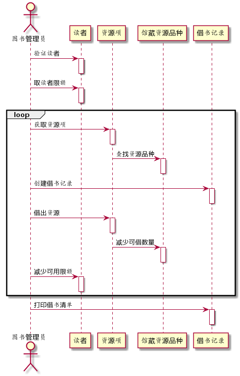
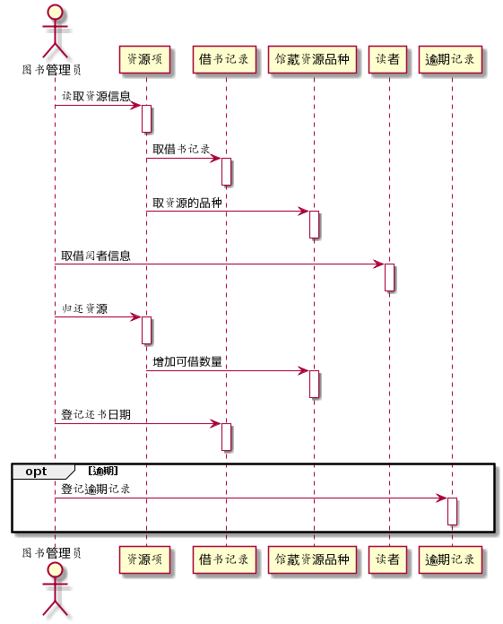

# 实验4：图书管理系统顺序图绘制

学号：201510414217

班级：15级软工2班

姓名：万佳羽

## 图书管理系统的顺序图

## 1. 借书用例

## 1.1 借书用例PlantUML源码

```
@startuml
actor 图书管理员

图书管理员 -> 读者:验证读者
activate 读者
deactivate 读者

图书管理员 -> 读者:取读者限额
activate 读者
deactivate 读者

group loop
图书管理员 -> 资源项:获取资源项
activate 资源项
deactivate 资源项

资源项 -> 馆藏资源品种:查找资源品种
activate 馆藏资源品种
deactivate 馆藏资源品种

图书管理员 -> 借书记录:创建借书记录
activate 借书记录
deactivate 借书记录

图书管理员 -> 资源项:借出资源
activate 资源项
deactivate 资源项

资源项 -> 馆藏资源品种:减少可借数量
activate 馆藏资源品种
deactivate 馆藏资源品种

图书管理员 -> 读者:减少可用限额
activate 读者
deactivate 读者
end

图书管理员 -> 借书记录:打印借书清单
activate 借书记录
deactivate 借书记录
@enduml
```

## 1.2 借书用例顺序图



## 1.3 借书用例顺序图说明

在借书的过程中，先要验证登录的用户是否符合借书的条件，如果符合，那么显示给用户可借阅的数额。再根据用户需要借阅的图书名称在馆藏的资源里查找图书，找到图书后图书管理员创建一个借书记录，并且取出图书后在资源库里减少相应的数量和用户可借阅数量，最后打印出借书清单。再需要说明的一点就是，用户在查找图书直至借书成功之前的整个过程，用户都是可以返回到前一步操作的，所以有一个loop循环。

## 2. 还书用例

## 2.1 还书用例PlantUML源码

```
@startuml
actor 图书管理员

图书管理员 -> 资源项:读取资源信息
activate 资源项
deactivate 资源项

资源项 -> 借书记录:取借书记录
activate 借书记录
deactivate 借书记录

资源项 -> 馆藏资源品种:取资源的品种
activate 馆藏资源品种
deactivate 馆藏资源品种

图书管理员 -> 读者:取借阅者信息
activate 读者
deactivate 读者

图书管理员 -> 资源项:归还资源
activate 资源项
deactivate 资源项

资源项 -> 馆藏资源品种:增加可借数量
activate 馆藏资源品种
deactivate 馆藏资源品种

图书管理员 -> 借书记录:登记还书日期
activate 借书记录
deactivate 借书记录

opt 逾期
图书管理员 -> 逾期记录:登记逾期记录
activate 逾期记录
deactivate 逾期记录
end
@enduml
```

## 2.2 还书用例顺序图



## 2.3 还书用例顺序图说明

在还书的过程中，图书管理员先要读取图书馆里的资源信息，找到之前用户借书时创建的借书记录，根据借书记录来找到馆藏资源的品种。再取借阅者信息，进行归还图书操作，增加用户的可借阅数量并登记用户的还书日期。若用户有逾期，则登记逾期记录并按照逾期的规定进行相应的金额罚款。