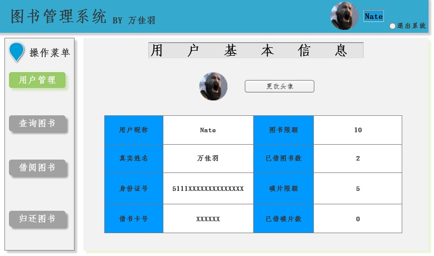

# 实验5：图书管理系统数据库设计与界面设计

学号：201510414217

班级：15级软工2班

姓名：万佳羽

## 1.数据库表设计

### 1.1 资源项表

|     字段      |    类型    | 主键，外键 | 可以为空 | 默认值 | 约束 |       说明       |
| :-----------: | :--------: | :--------: | :------: | :----: | :--: | :--------------: |
| serial_number |  int(100)  |    主键    |    否    |        |      |  馆藏资源的编号  |
|     state     | varchar(4) |            |    否    |        |      | 资源是否可以外借 |

### 1.2 碟片品种表

|        字段        |     类型     | 主键，外键 | 可以为空 | 默认值 | 约束 |      说明      |
| :----------------: | :----------: | :--------: | :------: | :----: | :--: | :------------: |
|     disc_type      | varchar(20)  |            |    否    |        |      |   碟片的类型   |
|      disc_num      |  varchar(4)  |            |    否    |        |      | 碟片剩余的数量 |
| production_company | varchar(100) |    主键    |    否    |        |      | 碟片制作的公司 |

### 1.3 图书品种表

|        字段         |     类型     | 主键，外键 | 可以为空 | 默认值 | 约束 |       说明       |
| :-----------------: | :----------: | :--------: | :------: | :----: | :--: | :--------------: |
|       author        | varchar(40)  |    主键    |    否    |        |      |  图书的作者名字  |
|        press        | varchar(100) |            |    否    |        |      | 图书的出版社名称 |
| date_of_publication | varchar(20)  |            |    否    |        |      |  图书的出版日期  |

### 1.4 馆藏资源品种表

|        字段        |     类型     | 主键，外键 | 可以为空 | 默认值 | 约束 |        说明        |
| :----------------: | :----------: | :--------: | :------: | :----: | :--: | :----------------: |
|    source_name     | varchar(100) |    主键    |    否    |        |      |     资源的名称     |
|        ISBN        | varchar(100) |            |    否    |        |      |    资源的出版号    |
|       price        |  double(20)  |            |    否    |        |      |     资源的价格     |
|      summary       | varchar(200) |            |    是    |        |      |   资源的简介介绍   |
|    total_number    |   int(20)    |            |    否    |        |      |   资源的总共数量   |
|    lend_number     |   int(20)    |            |    否    |        |      | 资源目前的可借数量 |
| production_company | varchar(100) |    外键    |    否    |        |      |   碟片制作的公司   |
|       author       | varchar(40)  |    外键    |    否    |        |      |   图书的作者名字   |
|   serial_number    |   int(100)   |    外键    |    否    |        |      |   馆藏资源的编号   |

### 1.5 预定记录表 

|      字段      |     类型     | 主键，外键 | 可以为空 | 默认值 | 约束 |         说明         |
| :------------: | :----------: | :--------: | :------: | :----: | :--: | :------------------: |
| Scheduled_date | varchar(20)  |    主键    |    否    |        |      | 客户预定此图书的日期 |
|  source_name   | varchar(100) |    外键    |    否    |        |      |      资源的名称      |

### 1.6 读者表

|      字段      |    类型     | 主键，外键 | 可以为空 | 默认值 | 约束 |         说明         |
| :------------: | :---------: | :--------: | :------: | :----: | :--: | :------------------: |
|    cus_name    | varchar(20) |    主键    |    否    |        |      |      客户的姓名      |
|   ID_number    |   int(20)   |            |    否    |        |      |    客户的身份证号    |
|  card_number   |   int(20)   |            |    否    |        |      |    客户的借书卡号    |
|   book_limit   |   int(4)    |            |    否    |        |      |  客户能借的图书数量  |
|   lent_book    |   int(4)    |            |    否    |        |      |  客户已借的图书数量  |
|   disc_limit   |   int(4)    |            |    否    |        |      |  客户能借的碟片数量  |
|   lent_disc    |   int(4)    |            |    否    |        |      |  客户已借的碟片数量  |
| Scheduled_date | varchar(20) |    外键    |    否    |        |      | 客户预定此图书的日期 |
|   lent_date    | varchar(20) |    外键    |    否    |        |      |    客户借书的日期    |

### 1.7 借书记录表

|     字段      |    类型     | 主键，外键 | 可以为空 | 默认值 | 约束 |         说明         |
| :-----------: | :---------: | :--------: | :------: | :----: | :--: | :------------------: |
|   lent_date   | varchar(20) |    主键    |    否    |        |      | 客户借阅此图书的日期 |
|  return_date  | varchar(20) |            |    否    |        |      | 客户归还此图书的日期 |
| serial_number |  int(100)   |    外键    |    否    |        |      |    馆藏资源的编号    |

### 1.8 逾期记录表

|     字段     |    类型     | 主键，外键 | 可以为空 | 默认值 | 约束 |         说明         |
| :----------: | :---------: | :--------: | :------: | :----: | :--: | :------------------: |
|  lent_date   | varchar(20) |    外键    |    否    |        |      | 客户借阅此图书的日期 |
| overdue_date |  int(100)   |    主键    |    否    |        |      |    客户逾期的天数    |

### 1.9 图书管理员表

|      字段       |    类型     | 主键，外键 | 可以为空 | 默认值 | 约束 |         说明         |
| :-------------: | :---------: | :--------: | :------: | :----: | :--: | :------------------: |
|    lent_date    | varchar(20) |    外键    |    否    |        |      | 客户借阅此图书的日期 |
| employee_number |   int(20)   |    主键    |    否    |        |      |  图书管理员的职工号  |
|   admin_name    | varchar(20) |            |    否    |        |      |   图书管理员的姓名   |

## 2. 界面设计

### 2.1 图书管理系统界面设计



- 用例图参见：图书管理系统用例
- 类图参见：读者类，图书品种类，碟片品种类等
- 顺序图参见：借书顺序图，还书顺序图
- API接口如下：

1.查询图书碟片API：

- 功能：系统能根据用户输入的信息来查找相应的图书或碟片
- 请求地址：http://localhost:8080/Library/Search
- 请求方法：POST
- 请求参数：

|  参数名称   | 必填 |                        说明                        |
| :---------: | :--: | :------------------------------------------------: |
| source_name |  是  | 馆藏资源品种表的主键，用于查询图书或碟片的所有信息 |

- 返回实例：

```
{
    "info": "资源信息",
    "data": {
        "source_name": "JAVA入门",
        "ISBN": "978-7-302-32982-4",
        "price": "39.00",
        "summary": "介绍如何入门JAVA",
        "total_number": "20",
        "lend_number": "18"
        },
    "code": 200
}
```

- 返回参数说明：

| 参数名称 |      说明      |
| :------: | :------------: |
|   info   |    返回信息    |
|   data   | 查询的图书信息 |
|   code   |     返回码     |

2.查看个人信息API：

- 功能：查看个人用户的全部信息
- 请求地址：http://localhost:8080/Library/Individual
- 请求方法：POST
- 请求参数：

| 参数名称 | 必填 |                   说明                   |
| :------: | :--: | :--------------------------------------: |
| cus_name |  是  | 读者表的主键，用于查看个人用户的全部信息 |

- 返回实例：

```
{
    "info": "读者信息",
    "data": {
        "cus_name": "万佳羽",
        "ID_number": "5111XXXXXXXXXXXXXX",
        "card_number": "123456",
        "book_limit": "10",
        "lent_book": "2",
        "disc_limit": "5",
        "lent_disc":"0"
        },
    "code": 200
}
```

- 返回参数说明：

| 参数名称 |      说明      |
| :------: | :------------: |
|   info   |    返回信息    |
|   data   | 客户的个人信息 |
|   code   |     返回码     |

3.借出图书API：

- 功能：借出客户想要的图书
- 请求地址：http://localhost:8080/Library/Lendbook
- 请求方法：POST
- 请求参数：

|   参数名称    | 必填 |                   说明                   |
| :-----------: | :--: | :--------------------------------------: |
| serial_number |  是  | 资源项表的主键，用于获取想要借的书的信息 |

- 返回实例：

```
{
    "info": "借阅图书",
    "data": {
    	"lent_date":"2018-5-7",
        "state": "已借阅"
        },
    "code": 200
}
```

- 返回参数说明：

| 参数名称  |       说明       |
| :-------: | :--------------: |
|   info    |     返回信息     |
| lent_date |  图书外借的日期  |
|   state   | 图书状态为已外借 |
|   code    |      返回码      |

4.归还图书API：

- 功能：借出客户想要的图书
- 请求地址：http://localhost:8080/Library/Returnbook
- 请求方法：POST
- 请求参数：

|   参数名称    | 必填 |                   说明                   |
| :-----------: | :--: | :--------------------------------------: |
| serial_number |  是  | 资源项表的主键，用于获取想要借的书的信息 |

- 返回实例：

```
{
    "info": "归还图书",
    "data": {
    	"return_date":"2018-5-17",
        "state": "已归还"
        },
    "code": 200
}
```

- 返回参数说明：

|  参数名称   |       说明       |
| :---------: | :--------------: |
|    info     |     返回信息     |
| return_date |  图书归还的日期  |
|    state    | 图书状态为已外借 |
|    code     |      返回码      |