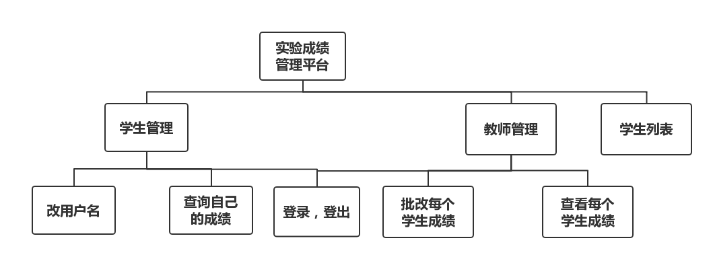

# 基于GitHub的实验管理平台的分析与设计

学号：201510414217

班级：15级软工2班

姓名：万佳羽

## 1. 概述

- 基于GitHub的实验管理平台的作用是在线管理实验成绩的Web应用系统。学生和老师的实验内容均存放在GitHUB 页面上。
- 学生的功能主要有：一是设置自己的GitHub用户名，二是查询自己的实验成绩。学生的GitHub用户名是公开的，但成绩不公开。
- 老师的功能主要有：一是批改每个学生的成绩，二是查看每个学生的成绩。
- 老师和学生都能通过本系统的链接方便地跳转到学生的每个GitHUB实验目录，以便批改实验或者查看实验情况。
- 实验成绩按数字分数计算，每项实验的满分为100分，最低为0分。
- 系统自动计算每个学生的所有实验的平均分。

## 2. 系统总体结构

界面设计参见：[https://wanjiayu.github.io/is_analysis/test6/UI/index.html](https://wanjiayu.github.io/is_analysis/test6/UI/index.html)

## 3. 用例图设计 [源码](https://github.com/wanjiayu/is_analysis/blob/master/test6/Code/用例图代码.puml)

​					**基于GitHub的实验成绩管理平台--用例图**

## 4. 类图设计 [源码](https://github.com/wanjiayu/is_analysis/blob/master/test6/Code/类图代码.puml)

​				**基于GitHub的实验成绩管理平台--类图**

## 5. 数据库设计

### USER表（用户表）

|      字段       |        类型        | 主键，外键 | 可以为空 | 默认值 | 约束 |     说明     |
| :-------------: | :----------------: | :--------: | :------: | :----: | :--: | :----------: |
|     USER_ID     |    NUMBER(8,0)     |    主键    |    否    |        |      |    用户ID    |
|      NAME       | VARCHAR2(50 BYTE)  |            |    否    |        |      | 用户真实姓名 |
| GITHUB_USERNAME | VARCHAR2(50 BYTE)  |            |    是    |   空   |      | GitHUB用户名 |
|    PASSWORD     | VARCHAR2(512 BYTE) |            |    是    |        |      |  用户的密码  |

### TEACHER表（老师表）

|    字段    |        类型        | 主键，外键 | 可以为空 | 默认值 | 约束 |      说明      |
| :--------: | :----------------: | :--------: | :------: | :----: | :--: | :------------: |
| TEACHER_ID | VARCHAR2(50 BYTE)  |    主键    |    否    |        |      |    老师编号    |
|   CLASS    | VARCHAR2(20 BYTE)  |    外键    |    否    |        |      |    班级编号    |
| SUBJECT_ID | VARCHAR2(50 BYTE)  |    外键    |    否    |        |      |    学科编号    |
| DEPARTMENT | VARCHAR2(400 BYTE) |            |    否    |        |      | 老师属于的部门 |

### STUDENT表（学生表）

|    字段    |        类型        | 主键，外键 | 可以为空 | 默认值 | 约束 |            说明            |
| :--------: | :----------------: | :--------: | :------: | :----: | :--: | :------------------------: |
| STUDENT_ID | VARCHAR2(50 BYTE)  |    主键    |    否    |        |      |          学生学号          |
|   CLASS    | VARCHAR2(20 BYTE)  |    外键    |    否    |        |      |          班级编号          |
| SUBJECT_ID | VARCHAR2(50 BYTE)  |    外键    |    否    |        |      |          学科编号          |
| RESULT_SUM | VARCHAR2(400 BYTE) |            |    是    |   空   |      | 总成绩，为空即表示没有成绩 |

### CLASS表（班级表）

| 字段  |       类型        | 主键，外键 | 可以为空 | 默认值 | 约束 |   说明   |
| :---: | :---------------: | :--------: | :------: | :----: | :--: | :------: |
| CLASS | VARCHAR2(20 BYTE) |    主键    |    否    |        |      | 班级编号 |

### SUBJECT表（课程表）

|     字段     |        类型        | 主键，外键 | 可以为空 | 默认值 | 约束 |   说明   |
| :----------: | :----------------: | :--------: | :------: | :----: | :--: | :------: |
|  SUBJECT_ID  | VARCHAR2(50 BYTE)  |    主键    |    否    |        |      | 学科编号 |
| SUBJECT_NAME | VARCHAR2(100 BYTE) |            |    否    |        |      | 学科名称 |

### GRADE表（成绩表）

|    字段     |        类型        |   主键，外键    | 可以为空 | 默认值 |   约束    |                       说明                       |
| :---------: | :----------------: | :-------------: | :------: | :----: | :-------: | :----------------------------------------------: |
| STUDENT_ID  | VARCHAR2(50 BYTE)  | 联合主键1，外键 |    否    |        |           |             学生学号，STUDENT表外键              |
|   TEST_ID   |    NUMBER(6,0)     | 联合主键2，外键 |    否    |        |           |              实验编号，TESTS表外键               |
|   RESULT    |       NUMBER       |                 |    是    |   空   | 取值0-100 |     分数，这个值为空表示没有批改或未提交作业     |
|  EVALUATE   | VARCHAR2(400 BYTE) |                 |    是    |   空   |           |               老师对本次实验的评价               |
| UPDATE_DATE |        DATE        |                 |    是    |   空   |           | 老师批改实验的日期，值为空表示未批改或未提交作业 |

### TEST表（实验表）

|   字段    |        类型        | 主键，外键 | 可以为空 | 默认值 | 约束 |   说明   |
| :-------: | :----------------: | :--------: | :------: | :----: | :--: | :------: |
|  TEST_ID  |    NUMBER(6,0)     |    主键    |    否    |        |      | 实验编号 |
| TEST_NAME | VARCHAR2(100 BYTE) |            |    否    |        |      | 实验名称 |

## 6. 用例及界面详细设计

- ### [“登录”用例](https://github.com/wanjiayu/is_analysis/blob/master/test6/UseCase/登录.md),[界面](https://wanjiayu.github.io/is_analysis/test6/UI/login.html)

- ### [“选择课程”用例](https://github.com/wanjiayu/is_analysis/blob/master/test6/UseCase/选择课程.md)，[界面](https://wanjiayu.github.io/is_analysis/test6/UI/select_subject.html)

- ### [“学生列表”用例](https://github.com/wanjiayu/is_analysis/blob/master/test6/UseCase/学生列表.md)，[界面](https://wanjiayu.github.io/is_analysis/test6/UI/index.html)

- ### ["查看成绩"用例](https://github.com/wanjiayu/is_analysis/blob/master/test6/UseCase/查看成绩.md)，[界面](https://wanjiayu.github.io/is_analysis/test6/UI/view_scores.html)

- ###[“评定成绩”用例](https://github.com/wanjiayu/is_analysis/blob/master/test6/UseCase/评定成绩.md)，[界面](https://wanjiayu.github.io/is_analysis/test6/UI/evaluation_results.html)