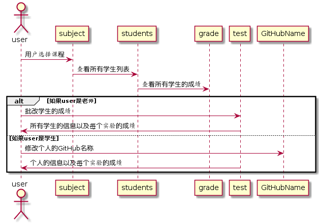

# “学生列表”用例 [返回](https://github.com/wanjiayu/is_analysis/blob/master/test6/README.md)

## 1. 用例规约

| 用例名称   | 登录                           |
| :--------- | :----------------------------- |
| 功能       | 显示所有学生的信息             |
| 参与者     | 游客，学生或教师               |
| 前置条件   | 学生和教师需要登录，游客不需要 |
| 后置条件   |                                |
| 主事件流   |                                |
| 备选事件流 |                                |

## 2. 业务流程（顺序图） [源码](https://github.com/wanjiayu/is_analysis/blob/master/test6/Code/学生列表.puml)

 

## 3. 界面设计

界面参照: [https://wanjiayu.github.io/is_analysis/test6/UI/index.html](https://wanjiayu.github.io/is_analysis/test6/UI/index.html)

## 4. 参照表

- GRADE表
- STUDENT表
- TEST表

## 5. API接口设计

- 功能： 显示所有学生信息
- 权限： 用户和游客
- API请求地址：http://202.115.82.8:1522/v1/api/students
- 请求方式 ： GET


- 请求实例：

```
无
```

- 请求参数说明:

无

- 返回实例：

```
  { 
      "status": true,
      "info": 成功,
      "data":[
          {
              "STUDENT_ID":"201510414217",
              "NAME":"万佳羽",
              "CLASS":"软工2班",
              "GITHUB_USERNAME":"wanjiayu",
              "RESULT":"90,85,88,90,87,85",
              "EVALUATE":"做的不错,....."
          }
          
          {
              ....其他学生的信息
          }
      ] 
  }
```

- 返回参数说明：

|    参数名称     |                      说明                       |
| :-------------: | :---------------------------------------------: |
|     status      | bool类型，true表示正确返回，false表示返回有错误 |
|      info       |                  返回结果说明                   |
|      data       |                 返回的学生信息                  |
|   STUDENT_ID    |                    学生的ID                     |
|      NAME       |                   学生的姓名                    |
|      CLASS      |                 学生所在的班级                  |
| GITHUB_USERNAME |                学生的GitHub名称                 |
|     RESULT      |                 学生的实验成绩                  |
|    EVALUATE     |              老师对每个实验的评价               |