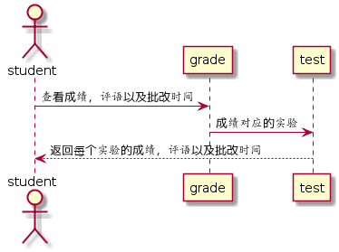

# “查看成绩”用例 [返回](https://github.com/wanjiayu/is_analysis/blob/master/test6/README.md)

## 1. 用例规约

| 用例名称   | 登录               |
| :--------- | :----------------- |
| 功能       | 学生查看自己的成绩 |
| 参与者     | 学生               |
| 前置条件   | 学生需要登录       |
| 后置条件   |                    |
| 主事件流   |                    |
| 备选事件流 |                    |

## 2. 业务流程（顺序图） [源码](https://github.com/wanjiayu/is_analysis/blob/master/test6/Code/查看成绩.puml)

 

## 3. 界面设计

界面参照: [https://wanjiayu.github.io/is_analysis/test6/UI/view_scores.html](https://wanjiayu.github.io/is_analysis/test6/UI/view_scores.html)

## 4. 参照表

- GRADE表
- STUDENT表
- TEST表

## 5. API接口设计

- 功能： 显示登录学生当前课程的所有实验成绩以及教师评语
- 权限： 学生
- API请求地址：http://202.115.82.8:1522/v1/api/getStudentScores
- 请求方式 ： GET


- 请求实例：

```
 {
      "student_id":"201510414217"
  }
```

- 请求参数说明:

|  参数名称  |    说明    |
| :--------: | :--------: |
| student_id | 学生的学号 |

- 返回实例：

```
  { 
      "status": true,
      "info": 成功,
      "name": "万佳羽",
      "student_id": "201510414217", 
      "class": "软工2班", 
      "result":"90,85,88,90,87,85",
      "evaluate:"做的不错,.....",
      "update_date": "2018-6-2 13:14"
  }
```

- 返回参数说明：

|  参数名称   |                      说明                       |
| :---------: | :---------------------------------------------: |
|   status    | bool类型，true表示正确返回，false表示返回有错误 |
|    info     |                  返回结果说明                   |
|    name     |                   学生的姓名                    |
| student_id  |                    学生的ID                     |
|    class    |                 学生所在的班级                  |
|   result    |               学生的所有实验成绩                |
|  evaluate   |              教师对学生实验的评价               |
| update_date |                 教师批改的日期                  |