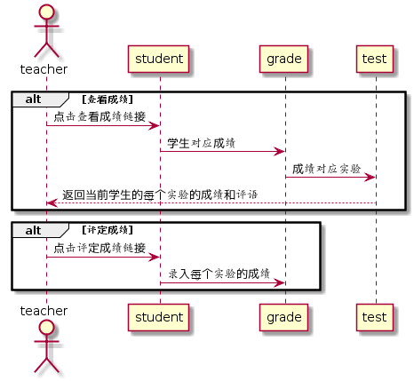

# “评定成绩”用例 [返回](https://github.com/wanjiayu/is_analysis/blob/master/test6/README.md)

## 1. 用例规约

| 用例名称   | 登录                         |
| :--------- | :--------------------------- |
| 功能       | 教师对学生的实验进行成绩评定 |
| 参与者     | 教师                         |
| 前置条件   | 教师需要登录                 |
| 后置条件   |                              |
| 主事件流   |                              |
| 备选事件流 |                              |

## 2. 业务流程（顺序图） [源码](https://github.com/wanjiayu/is_analysis/blob/master/test6/Code/评定成绩.puml)

 

## 3. 界面设计

界面参照: [https://wanjiayu.github.io/is_analysis/test6/UI/evaluation_results.html](https://wanjiayu.github.io/is_analysis/test6/UI/evaluation_results.html)

## 4. 参照表

- GRADE表
- STUDENT表
- TEST表

## 5. API接口设计

- 功能： 教师对学生的实验进行成绩评定以及评价
- 权限： 教师
- API请求地址：http://202.115.82.8:1522/v1/api/setStudentScores
- 请求方式 ： POST


- 请求实例：

```
 {
      "student_id":"201510414217",
      "data":
      [
      	{
        	"test_id":"1",
            "test_name":"业务流程建模",
            "result":"90",
            "evaluate":"做的不错"
      	}
      	
      	{
            ....其他实验
      	}
      ]
  }
```

- 请求参数说明:

|  参数名称  |         说明         |
| :--------: | :------------------: |
| student_id |    批改学生的学号    |
|    data    | 批改实验的成绩和评价 |
|  test_id   |  当前批改实验的编号  |
| test_name  |  当前批改实验的名称  |
|   result   |      批改的成绩      |
|  evaluate  |    当前实验的评价    |

- 返回实例：

```
  { 
      "status": true,
      "info": 成功
  }
```

- 返回参数说明：

| 参数名称 |                      说明                       |
| :------: | :---------------------------------------------: |
|  status  | bool类型，true表示正确返回，false表示返回有错误 |
|   info   |                  返回结果说明                   |